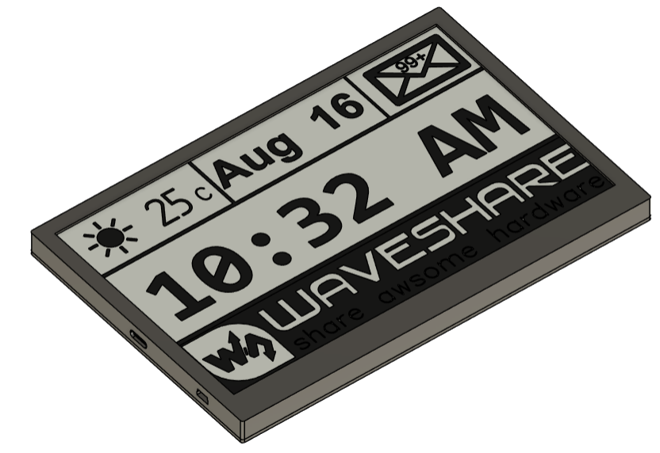

# UpdateMate

**UpdateMate** is an open-source, low-power ePaper tablet designed for tinkerers, developers, and DIY enthusiasts.  
Built around the ESP32 microcontroller, it offers a customizable platform for displaying relevant, distraction-free information — from weather forecasts and calendar events to news, sensor data, and more.

# Preview

<table>
  <tr>
    <td align="center"> 3D View of Tablet</td>
    <td align="center"> 3D View of PCB</td>
  </tr>
</table>

## Features

- 🖥️ 7.5-inch black-and-white ePaper display from Waveshare  
- ⚡ Low power consumption with deep sleep support  
- 🧩 Rich peripheral support: sensors, SD card, RTC, fuel gauge, and more  
- 🔧 Designed for customization: easily add your own widgets, components, or software

## Ideal for

- 📖 eBook and tablet replacements  
- 🏡 Smart home dashboards  
- 🌦️ Always-on weather/news displays  
- 📅 Personal productivity boards  
- 📡 IoT project front-ends  
- 🧪 Educational embedded systems kits

