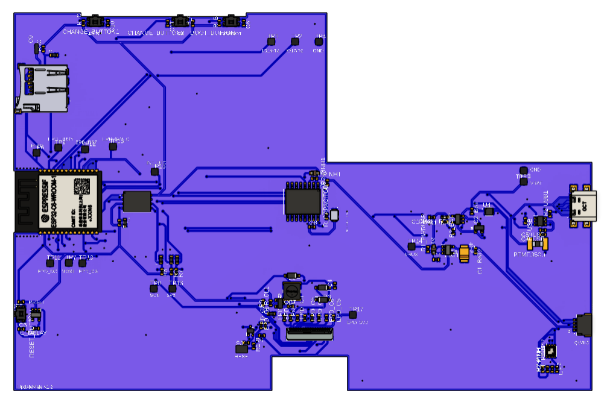
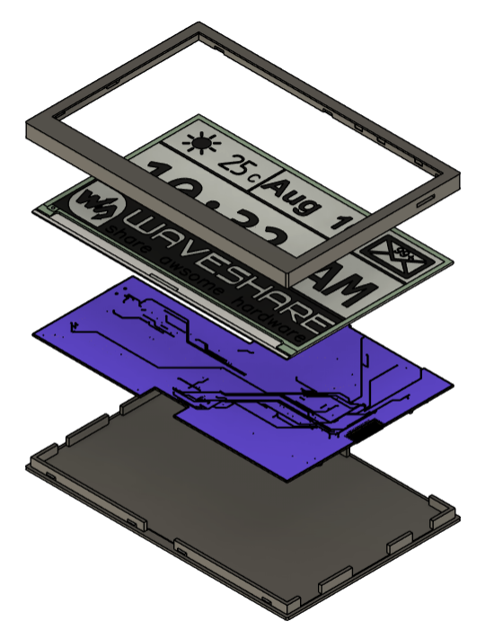
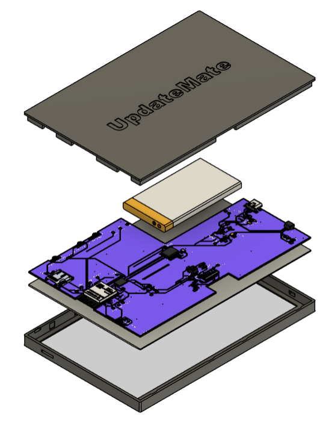
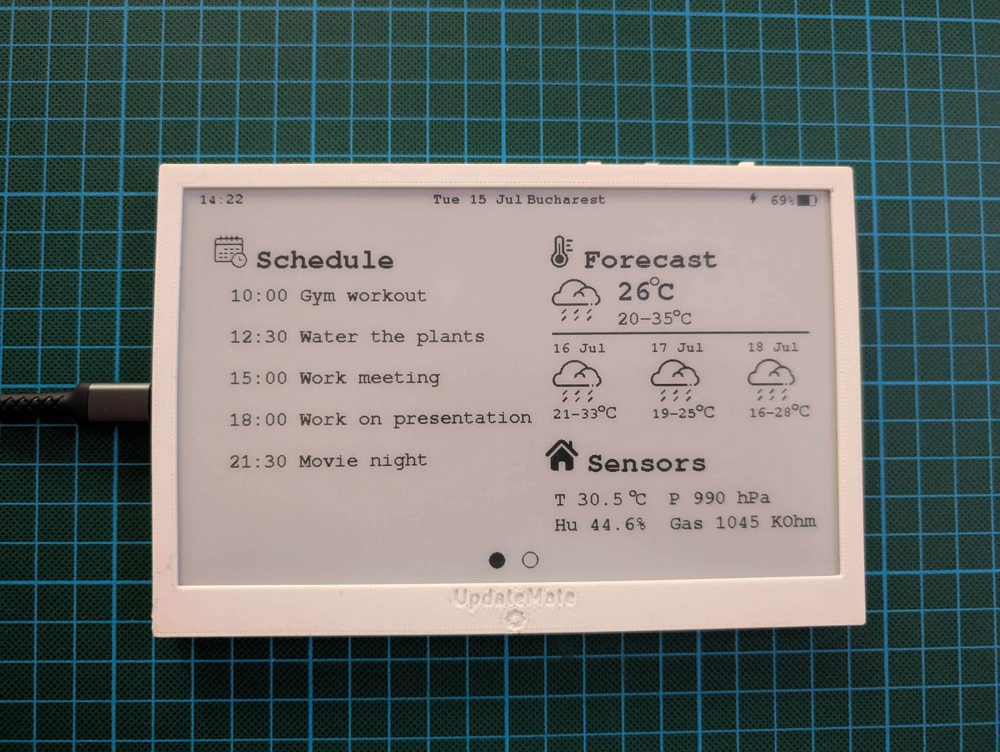
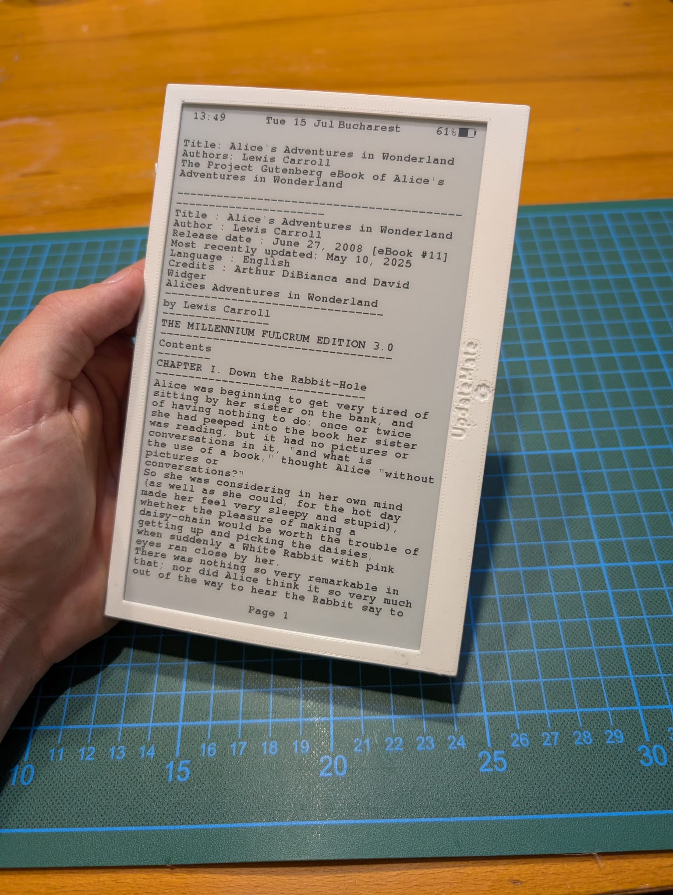
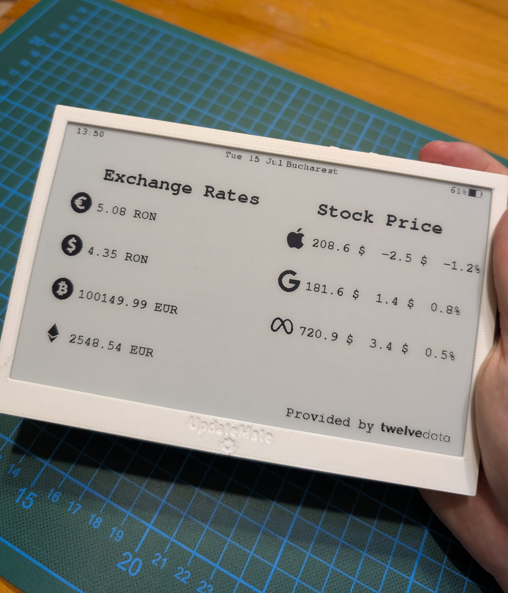
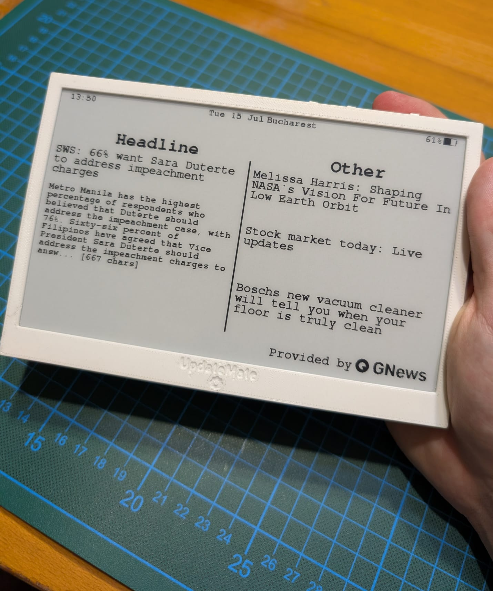
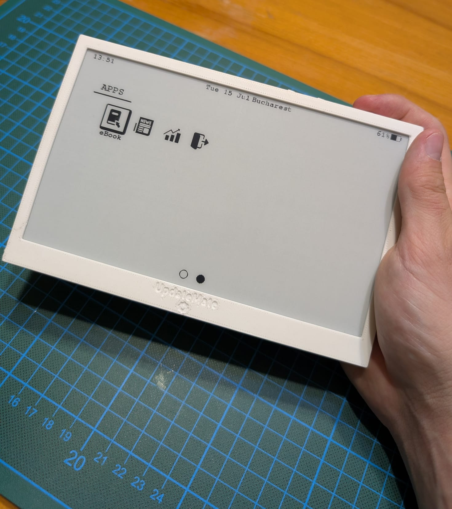
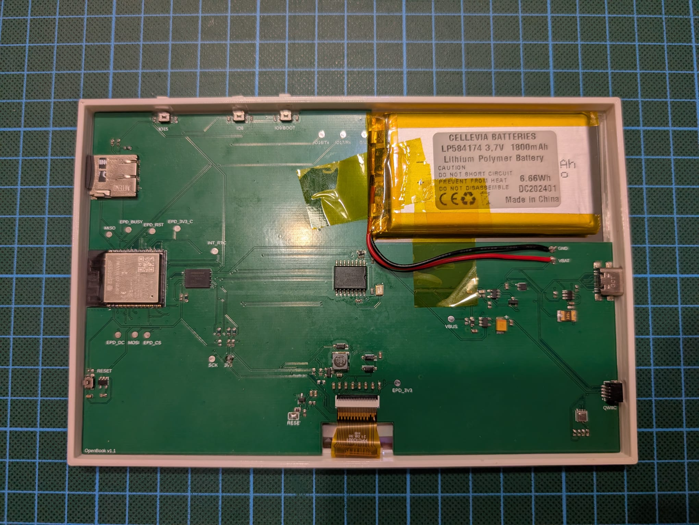

# UpdateMate

**UpdateMate** is an open-source, low-power ePaper tablet designed for tinkerers, developers, and DIY enthusiasts.  
Built around the ESP32 microcontroller, it offers a customizable platform for displaying relevant, distraction-free information — from weather forecasts and calendar events to news, sensor data, and more.

## Preview

<table>
  <tr>
    <td align="center"> 3D View of Tablet</td>
    <td align="center"> 3D View of PCB</td>
  </tr>
  <tr>
    <td align="center"> Exploded View (Top)</td>
    <td align="center"> Exploded View (Bottom)</td>
  </tr>
</table>

## Features

- 🖥️ 7.5-inch black-and-white ePaper display from Waveshare  
- ⚡ Low power consumption with deep sleep support  
- 🧩 Rich peripheral support: sensors, SD card, RTC, fuel gauge, and more  
- 🔧 Designed for customization: easily add your own widgets, components, or software

## Ideal for

- 📖 eBook and tablet replacements  
- 🏡 Smart home dashboards  
- 🌦️ Always-on weather/news displays  
- 📅 Personal productivity boards  
- 📡 IoT project front-ends  
- 🧪 Educational embedded systems kits

## Bill of Materials (BoM)

The main components in the tablet

| Component               | Interface | Description                                 | Link |
|------------------------|-----------|---------------------------------------------|------|
| **ESP32-C6-WROOM-1-N4**| MCU       | Main microcontroller                        | [Mouser](https://eu.mouser.com/ProductDetail/Espressif-Systems/ESP32-C6-WROOM-1-N4?qs=8Wlm6%252BaMh8R1JRAtXlt87w%3D%3D) |
| **7.5" Waveshare ePaper** | SPI    | Black-and-white e-paper display             | [Waveshare](https://www.waveshare.com/7.5inch-e-paper.htm) |
| **MicroSD Card Socket** | SPI       | For storage and data logging                | [TME](https://www.tme.eu/ro/details/mcc-sdmicro/conectori-pentru-cartele/attend/112a-taar-r03/?utm_source=google&utm_medium=cpc&utm_campaign=RUMUNIA%20%5BP%5D%5BDC%5D&gad_source=1&gad_campaignid=8175080604&gbraid=0AAAAADyylhKvBZhJjt9PiCTA7ccHCAagN&gclid=Cj0KCQjw-NfDBhDyARIsAD-ILeD5bqtRTQDJJ5KzH339OMhsTZl5OwnY6A_-zTqHLYSh2y26Atg0Cr8aAshjEALw_wcB&gclsrc=aw.ds) |
| **W25Q512JVEIQ NOR Flash** | SPI  | 64 MB external flash memory                 | [Mouser](https://eu.mouser.com/ProductDetail/Winbond/W25Q512JVEIQ?qs=l7cgNqFNU1jw6svr3at6tA%3D%3D) |
| **MAX17048 Fuel Gauge** | I2C       | Battery voltage and state-of-charge monitor | [Mouser](https://eu.mouser.com/ProductDetail/Analog-Devices-Maxim-Integrated/MAX17048G%2bT10?qs=D7PJwyCwLAoGnnn8jEPRBQ%3D%3D) |
| **BME680 Sensor Board** | I2C       | Environmental sensor (temp, humidity, gas)  | [Mouser](https://eu.mouser.com/ProductDetail/Bosch-Sensortec/BME680-Shuttle-Board-3.0?qs=Wj%2FVkw3K%252BMABg5lm5143Ww%3D%3D) |
| **DS3231SN RTC**        | I2C       | Real-time clock with temperature compensation | [Mouser](https://eu.mouser.com/ProductDetail/Analog-Devices-Maxim-Integrated/DS3231SN?qs=1eQvB6Dk1vhUlr8%2FOrV0Fw%3D%3D&utm_id=20109199409&utm_source=google&utm_medium=cpc&utm_marketing_tactic=emeacorp&gad_source=1&gad_campaignid=20109199409&gbraid=0AAAAADn_wf2OPp6JmRENVY2T7SRbqdMYH&gclid=Cj0KCQjw-NfDBhDyARIsAD-ILeBzHcIxR8KDbRAJnh_ZM7th9YkG_cXsf5fStQOxZy3EcUWmKn77gJcaAmQ9EALw_wcB) |

## Gallery

Pictures with the features already implemented on the tablet.

<table>
  <tr>
    <td align="center">
       
      Main Page View
    </td>
    <td align="center">
       
      eBook Page View
    </td>
    <td align="center">
       
      Stock Page View
    </td>
  </tr>
  <tr>
    <td align="center">
       
      News Page View
    </td>
    <td align="center">
       
      App Launcher View
    </td>
    <td align="center">
       
      PCB inside case
    </td>
  </tr>
</table>

